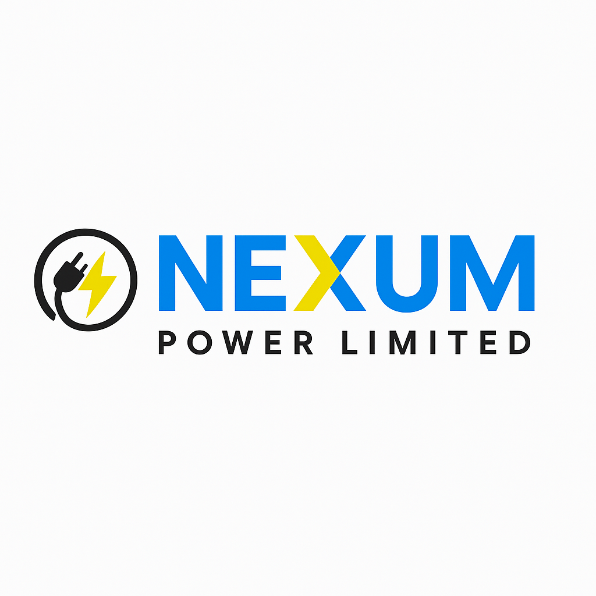

<!-- # Nexum Power Limited - Web Portfolio -->

<h1 align="center">⚡ Nexum Power Limited - Web Portfolio ⚡</h1>

<p align="center">
  
</p>

<p align="center"><strong>Powering Kenya's Growth Through Innovation and Excellence</strong></p>

A modern, responsive web portfolio for **Nexum Power Limited** — Kenya's premier electronics and electrical solutions provider based in Kenya, Machakos County.


> **Powering Kenya's Growth Through Innovation and Excellence**

A modern, responsive web portfolio for Nexum Power Limited - Kenya's premier electronics and electrical solutions provider based in Kenya, Machakos County.

[](https://opensource.org/licenses/MIT)
[](https://reactjs.org/)
[](https://nodejs.org/)
[](https://expressjs.com/)
[](https://vitejs.dev/)

## 🚀 Live Demo

- **Production**: [https://www.nexumpower.co.ke](https://www.nexumpower.co.ke)
- **Staging**: [https://staging.nexumpower.co.ke](https://staging.nexumpower.co.ke)

## 📋 Table of Contents

- [About Nexum Power Limited](#about-nexum-power-limited)
- [Features](#features)
- [Tech Stack](#tech-stack)
- [Project Structure](#project-structure)
- [Getting Started](#getting-started)
- [Development](#development)
- [Deployment](#deployment)
- [API Documentation](#api-documentation)
- [Contributing](#contributing)
- [License](#license)
- [Contact](#contact)

## 🏢 About Nexum Power Limited

Nexum Power Limited is a comprehensive electronics and electrical solutions provider established in 2025, serving the growing Kenya community and surrounding areas in Machakos County, Kenya. We specialize in:

- **Electronics & Appliances**: Protection devices, mobile accessories, home appliances
- **Electrical Solutions**: Components, installation services, maintenance
- **Solar Systems**: Design, installation, and maintenance
- **Cyber Services**: eCitizen, KRA services, printing, internet access
- **Professional Services**: Technical consultations, equipment rental

## ✨ Features

### 🎨 Frontend Features
- **Modern UI/UX**: Clean, responsive design with smooth animations
- **Product Showcase**: Interactive product catalog with filtering and search
- **Service Portfolio**: Detailed service descriptions with image galleries
- **Quote System**: Real-time quote generation for products and services
- **Contact Integration**: Multiple contact methods with form validation
- **Location Services**: Interactive map integration for directions
- **Multi-language Support**: English and Swahili language options
- **PWA Ready**: Progressive Web App capabilities for mobile users

### 🔧 Backend Features
- **RESTful API**: Comprehensive API for all business operations
- **Quote Management**: Automated quote generation and tracking
- **Contact Management**: Lead capture and customer communication
- **Product Management**: Inventory display and basic management
- **Service Booking**: Appointment scheduling system
- **Analytics Dashboard**: Business metrics and visitor analytics
- **Email Integration**: Automated email notifications
- **Security**: Rate limiting, input validation, and security headers

## 🛠 Tech Stack

### Frontend
- **Framework**: React 18.x
- **Build Tool**: Vite 4.x
- **Styling**: Tailwind CSS
- **State Management**: Zustand
- **Routing**: React Router v6
- **Forms**: React Hook Form + Zod validation
- **Animations**: Framer Motion
- **Icons**: Lucide React
- **HTTP Client**: Axios

### Backend
- **Runtime**: Node.js 18.x
- **Framework**: Express.js 4.x
- **Database**: MongoDB with Mongoose
- **Authentication**: JWT
- **File Upload**: Multer
- **Email Service**: Nodemailer
- **Validation**: Joi
- **Security**: Helmet, CORS, Rate Limiting
- **Documentation**: Swagger/OpenAPI

### DevOps & Tools
- **Version Control**: Git
- **Package Manager**: npm/yarn
- **Environment**: Docker (optional)
- **CI/CD**: GitHub Actions
- **Hosting**: Vercel (Frontend) + Railway (Backend)
- **Monitoring**: Sentry (Error tracking)

## 📁 Project Structure

```
nexumwebportfolio/
├── client/                     # React frontend
│   ├── public/
│   │   ├── images/
│   │   └── favicon.ico
│   ├── src/
│   │   ├── components/         # Reusable components
│   │   │   ├── common/
│   │   │   ├── forms/
│   │   │   └── layout/
│   │   ├── pages/              # Page components
│   │   │   ├── Home/
│   │   │   ├── Products/
│   │   │   ├── Services/
│   │   │   ├── About/
│   │   │   └── Contact/
│   │   ├── hooks/              # Custom React hooks
│   │   ├── store/              # Zustand store
│   │   ├── services/           # API service functions
│   │   ├── utils/              # Utility functions
│   │   ├── styles/             # Global styles
│   │   └── types/              # TypeScript types
│   ├── package.json
│   └── vite.config.js
├── server/                     # Express backend
│   ├── src/
│   │   ├── controllers/        # Request handlers
│   │   ├── middleware/         # Custom middleware
│   │   ├── models/             # Database models
│   │   ├── routes/             # API routes
│   │   ├── services/           # Business logic
│   │   ├── utils/              # Utility functions
│   │   ├── config/             # Configuration files
│   │   └── app.js              # Express app setup
│   ├── package.json
│   └── server.js
├── docs/                       # Documentation
├── scripts/                    # Build and deployment scripts
├── .github/                    # GitHub Actions workflows
├── docker-compose.yml          # Docker setup (optional)
├── README.md
└── LICENSE
```

## 🚀 Getting Started

### Prerequisites

- **Node.js** (v18.x or higher)
- **npm** or **yarn**
- **MongoDB** (local or cloud instance)
- **Git**

### Installation

1. **Clone the repository**
   ```bash
   git clone https://github.com/nexumpower/nexumwebportfolio.git
   cd nexumwebportfolio
   ```

2. **Install dependencies**
   ```bash
   # Install backend dependencies
   cd server
   npm install
   
   # Install frontend dependencies
   cd ../client
   npm install
   ```

3. **Environment Setup**
   
   Create `.env` files in both client and server directories:
   
   **Server (.env)**
   ```env
   NODE_ENV=development
   PORT=5000
   MONGODB_URI=mongodb://localhost:27017/nexumpower
   JWT_SECRET=your-super-secret-jwt-key
   
   # Email Configuration
   SMTP_HOST=smtp.gmail.com
   SMTP_PORT=587
   SMTP_USER=your-email@gmail.com
   SMTP_PASS=your-app-password
   
   # API Keys
   GOOGLE_MAPS_API_KEY=your-google-maps-key
   
   # Security
   CORS_ORIGIN=http://localhost:3000
   RATE_LIMIT_WINDOW=15
   RATE_LIMIT_MAX=100
   ```
   
   **Client (.env)**
   ```env
   VITE_API_URL=http://localhost:5000/api
   VITE_GOOGLE_MAPS_API_KEY=your-google-maps-key
   VITE_SITE_URL=http://localhost:3000
   ```

4. **Database Setup**
   ```bash
   # Start MongoDB service
   # For local MongoDB:
   mongod
   
   # For Docker:
   docker run -d -p 27017:27017 --name nexum-mongo mongo:latest
   ```

5. **Start Development Servers**
   ```bash
   # Terminal 1: Start backend server
   cd server
   npm run dev
   
   # Terminal 2: Start frontend server
   cd client
   npm run dev
   ```

6. **Access the Application**
   - Frontend: http://localhost:3000
   - Backend API: http://localhost:5000
   - API Documentation: http://localhost:5000/api-docs

## 🔨 Development

### Available Scripts

#### Frontend (client/)
```bash
npm run dev          # Start development server
npm run build        # Build for production
npm run preview      # Preview production build
npm run lint         # Run ESLint
npm run format       # Format code with Prettier
npm run test         # Run tests
```

#### Backend (server/)
```bash
npm run dev          # Start development server with nodemon
npm run start        # Start production server
npm run build        # Build TypeScript (if applicable)
npm run lint         # Run ESLint
npm run test         # Run tests
npm run seed         # Seed database with sample data
```

### Code Style & Standards

- **ESLint**: Configured for React and Node.js
- **Prettier**: Code formatting
- **Husky**: Git hooks for pre-commit checks
- **Conventional Commits**: Commit message format

### Development Guidelines

1. **Component Structure**: Use functional components with hooks
2. **State Management**: Use Zustand for global state
3. **API Integration**: Use React Query for server state
4. **Styling**: Use Tailwind CSS utility classes
5. **Error Handling**: Implement proper error boundaries
6. **Testing**: Write unit tests for components and API endpoints

## 🚀 Deployment

### Production Deployment

#### Frontend (Vercel)
1. Connect your GitHub repository to Vercel
2. Set environment variables in Vercel dashboard
3. Deploy automatically on push to main branch

#### Backend (Railway)
1. Connect your GitHub repository to Railway
2. Set environment variables in Railway dashboard
3. Deploy automatically on push to main branch

### Manual Deployment

#### Frontend
```bash
cd client
npm run build
# Deploy dist/ folder to your hosting service
```

#### Backend
```bash
cd server
npm run build  # If using TypeScript
npm start      # Start production server
```

### Environment Variables

Ensure all production environment variables are properly set:
- Database connection strings
- JWT secrets
- Email service credentials
- API keys
- CORS origins

## 📚 API Documentation

### Authentication
```bash
POST /api/auth/register
POST /api/auth/login
POST /api/auth/refresh
```

### Products
```bash
GET    /api/products          # Get all products
GET    /api/products/:id      # Get product by ID
POST   /api/products          # Create product (admin)
PUT    /api/products/:id      # Update product (admin)
DELETE /api/products/:id      # Delete product (admin)
```

### Services
```bash
GET    /api/services          # Get all services
GET    /api/services/:id      # Get service by ID
POST   /api/services/book     # Book a service
```

### Quotes
```bash
POST   /api/quotes            # Request quote
GET    /api/quotes/:id        # Get quote by ID
PUT    /api/quotes/:id        # Update quote status
```

### Contact
```bash
POST   /api/contact           # Send contact message
GET    /api/contact           # Get contact messages (admin)
```

Full API documentation is available at `/api-docs` when running the server.

## 🤝 Contributing

We welcome contributions to improve the Nexum Power Limited web portfolio! Here's how you can help:

### Getting Started
1. Fork the repository
2. Create a feature branch: `git checkout -b feature/your-feature-name`
3. Make your changes
4. Run tests: `npm test`
5. Commit your changes: `git commit -m 'Add some feature'`
6. Push to the branch: `git push origin feature/your-feature-name`
7. Submit a pull request

### Contribution Guidelines
- Follow the existing code style and conventions
- Write clear commit messages
- Include tests for new features
- Update documentation as needed
- Ensure all tests pass before submitting

### Issues & Bug Reports
- Use the GitHub issue tracker
- Provide clear reproduction steps
- Include relevant screenshots or logs
- Tag issues appropriately

## 📄 License

This project is licensed under the MIT License - see the [LICENSE](LICENSE) file for details.

## 📞 Contact

**Nexum Power Limited**

- **Address**: Kenya, Machakos County, Kenya
- **Phone**: +254 11 31 74493
- **Email**:  nexumpowerlimited@gmail.com
- **Website**: https://www.nexumpower.co.ke

### Development Team

- **Lead Developer**: [Your Name]
- **UI/UX Designer**: [Designer Name]
- **Backend Developer**: [Developer Name]

### Support

For technical support or questions about the web portfolio:
- Create an issue in this repository
- Email: dev@nexumpower.co.ke
- WhatsApp: +254 11 31 74493

---

## 🌟 Acknowledgments

- Icons by [Lucide](https://lucide.dev/)
- Design inspiration from modern electronics websites
- Kenya's growing tech ecosystem
- The supportive Kenya business community

---

**Built with ❤️ in Kenya | Powering Growth Through Innovation**

*This README is a living document. Please keep it updated as the project evolves.*